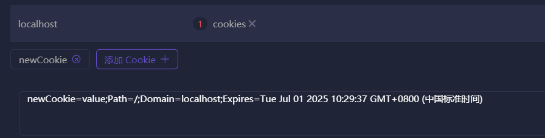

# 丐版Tomcat的实现
>结合GitHub上的历史记录中的代码理解，自用的，基本就是想到哪写到哪。  
> 目前发现两处错误，在`实现@WebServlet注解、URI和方法名映射`和`实现转发（include、forward）`的代码块中用注释标注，有时间再改源码
## request的简单实现
>request最基础的功能就是那些get方法获取响应报文的信息，要实现最简单的request就得解析请求报文，  
    获取到这些信息
- 先通过get方法获取到socket的字节输入流和输出流，把字节输入流传入到 `TomcatHttpServletRequest` 中。  
- `TomcatHttpServletRequest` 实现了 `HttpServletRequest` 接口，在 `TomcatHttpServletRequest`的构造方法中，我们解析传过来的字节输入流的内容，也就是请求报文。  
    ```` java
        public TomcatHttpServletRequest(InputStream inputStream) {
            try {
                byte[] temp = new byte[8196];
                int read = inputStream.read(temp);
                String s = new String(temp, 0, read, StandardCharsets.UTF_8);
                System.out.println("以下是请求报文：");
                this.requestContent = s;
                this.requestHeaders = new HashMap<>();
                System.out.println(s);
                int headerBeginIndex = this.requestContent.indexOf("\n");
                int headerEndIndex = this.requestContent.indexOf("\r\n\r\n");
                String substring = this.requestContent.substring(headerBeginIndex + 1, headerEndIndex);
                String[] split = substring.split("\r\n");
                for (String headerKeyAndValue : split) {
                    int i = headerKeyAndValue.indexOf(":");
                    String headerKey = headerKeyAndValue.substring(0, i);
                    requestHeaders.put(headerKey, headerKeyAndValue.substring(i + 1));
                }
                this.requestLine = requestContent.substring(0, headerBeginIndex - 1);
                this.requestBody = requestContent.substring(headerEndIndex + 1);
            } catch (IOException e) {
                throw new RuntimeException(e);
            }
        }
    ````
    请求报文分成四个部分，请求行、请求头、空行、请求体。根据换行的分割，我们可以从请求报文中得到我们需要的信息，比如请求方法，uri，请求头和请求体的内容。  
    我们把这些属性从请求报文中切割出来，放入`TomcatHttpServletRequest`中的各种get方法，通过调用get方法我们就实现了简单的request功能。  
## response的简单实现
>用于返回给浏览器一个响应体，简单实现request是把请求报文拆散解析，简单实现response就是模仿请求报文的样子用  
    StringBulider拼出一个大的字符串，转为字节数组再放入字节输出流中
- 和request一样，先拿到socket的字节输出流，作为参数传入`TomcatHttpServletResponse`。在他的全参构造中我们可以设置默认的响应头,初始化响应体的字符输出流：  
    ```` java
    public TomcatHttpServletResponse(OutputStream outputStream) {
            this.outputStream = outputStream;
            this.headers = new HashMap<String, String>();
            this.headers.put("Content-Type", "text/html; charset=utf-8");
            this.status = 200;
            this.message = "OK";
            //字符输出流和字节输出流之间的媒介
            this.byteArrayOutputStream = new ByteArrayOutputStream();
            //可以用getWriter方法获取到这个字符输出流对象，通过这个对象调用.write方法
            //向响应体里写东西
            this.printWriter = new PrintWriter(this.byteArrayOutputStream);
            this.initStatusMessage();
        }
    
        public void initStatusMessage() {
            this.statusMessageMapping = new HashMap<>();
            //参考HTTPStatus.txt
            this.statusMessageMapping.put(200,"OK");
            this.statusMessageMapping.put(400,"Bad Request");
            this.statusMessageMapping.put(404, "Not Found");
            this.statusMessageMapping.put(405, "Method Not Allowed");
            this.statusMessageMapping.put(500, "Internal Server Error");
        }
    ````
    想新往里写入响应头的时候，调用setHeader方法，把kv存入一个map中
    ```` java
        @Override
        public void setHeader(String key, String value) {
            this.headers.put(key, value);
        }
    ````
    准备一个方法用于拼接没有响应体的响应报文，这个方法在此次请求结束，各种流关闭之前被调用，把设置的响应头之类的全拼进响应报文中
    ```` java
         public void prepareNoBodyResponse() throws IOException {
            this.stringBuffer = new StringBuffer();
            this.stringBuffer
                    .append("HTTP/1.1 ").append(status).append(" ").append(this.statusMessageMapping.get(this.status)).append("\r\n");//拼接响应行
            //根据响应头载体的内容拼接到响应报文中
            for (String headerKey : headers.keySet()) {
                this.stringBuffer.append(headerKey).append(": ").append(headers.get(headerKey)).append("\r\n");
            }
            //拼接空行
            this.stringBuffer.append("\r\n");
            //不拼响应体
        }
    ````
  <span id="jump1">这个方法</span>在此次请求结束，各种流关闭之前调用，在内部调用了上面那个拼接无响应体的响应报文方法，就是为了在用户把响应头全部设置完后，一口气全写到响应体里。最后再把响应报文也放入字节输出流里。
    ```` java
         public void finishedResponse() throws IOException {
            this.printWriter.flush();
            byte[] bodyBytes = byteArrayOutputStream.toByteArray();
            //准备没有响应体的响应报文
            this.prepareNoBodyResponse();
            //写入没有响应体的响应报文
            this.outputStream.write(this.stringBuffer.toString().getBytes(StandardCharsets.UTF_8));
            //写入响应体
            this.outputStream.write(bodyBytes);
    
            this.printWriter.close();
            this.byteArrayOutputStream.close();
        }
    ````
    这样返回的响应体就能被浏览器解析识别到，一个简单的response就实现完成了。
## 实现@WebServlet注解、URI和方法名映射和初始化servlet方法
>我们平时使用servlet时都要在servlet方法上上加一个@WebServlet("/temp")注解修饰,然后才能通过这个路径访问到对应的servlet，  
    要实现这个功能首先要找到注解、URI、方法名的映射关系。
- 首先我们准备一个`PreparedHandler`类，对我们的这些文件进行预处理，目前这个类下面只有三个方法：  
第一个类是对字符串做处理，拼接出我们文件的全限定类名备用.
    ```` java
        /**
         * 获取类的全限定类名
         * @param temp
         * @return
         */
        private static String getClassesInfo(File temp){
            String parent = temp.getParent();
            String src = parent.substring(parent.indexOf("src") + 4);
            String replace = src.replace("\\", ".");
            String containsJavaClassName = replace + "." + temp.getName();
            int i = containsJavaClassName.lastIndexOf(".");
            return containsJavaClassName.substring(0, i);
        }
    ````
    第二个方法递归地判断一个类是不是java类（后缀是`.java`），是的话就调用上一个方法，获取这个类的全限定类名，并且把他放入一个数组集合中。  
    ```` java
        /**
         * 递归地获取当前工程下所有类的全限定类名，放入一个数组集合中
         * @param folder
         * @return
         */
        public static List<String> getAllClasses(File folder) {
            if (folder.isDirectory()) {
                File[] files = folder.listFiles();
                if (files != null) {
                    for (File file : files) {
                        if (file.isDirectory()) {
                            getAllClasses(file);//递归处理子文件夹
                        } else if (file.getName().endsWith(".java")) {
                            //如果是java源文件，则获取类的信息
                            String className = getClassesInfo(file);
    //                        System.out.println("当前类的全限定类名："+className);
                            allClasses.add(className);
                        }
                    }
                }
            }
        }
    ````
  <span id="jump2">第三个方法</span>的参数是一个全限定类名的数组，就是第二个方法的返回值；第三个方法是遍历当前工程下所有类的全限定类名，并且通过反射的方式，获取有`@WebServlet()`注解的类。  
    并将当前`@WebServlet`注解的值`value` 和 这个类的全限定名称 做绑定。  
    ```` java
        /**
         * 遍历当前工程下所有类的全限定类名
         * 通过反射的方式，获取存在@WebServlet注解的类
         * 并将当前@WebServlet注解的值value 和 这个类的全限定名称 做绑定
         * @param currentProjectAllClassesName
         * @throws ClassNotFoundException
         */
        public static Map<String, String> initURIMapping(List<String> currentProjectAllClassesName) throws ClassNotFoundException {
            for (String className : currentProjectAllClassesName) {
                Class<?> aClass = Class.forName(className);
                WebServlet annotation = aClass.getAnnotation(WebServlet.class);
                if(annotation != null){
                    //如果有注解就把uri作为key 全限定类名 作为value放入map中，相当于是创建了映射关系
                    URIMapping.put(annotation.value(), className);
                }
            }
    //        System.out.println(URIMapping);
            return URIMapping;
        }
    ````
    准备好了以上三个方法，就可以去到Service中完成逻辑了。  
- 我们在Servlet中准备好我们项目的路径，以便于获取所有`.java`文件的全限定类名，然后放入一个集合中传入第三个方法遍历并绑定映射关系。  
    ```` java
        public static final String sourceFolder = "E:\\project\\Tomcat\\src";
    
        private static Map<String, String> URIMappings;
    
        File file = new File(sourceFolder);
        List<String> currentProjectAllClassesName = PreparedHandler.getAllClasses(file);
        URIMappings = PreparedHandler.initURIMapping(currentProjectAllClassesName);
    ````
    当请求来到的时候，我们利用request域对象获取到uri，如果这个uri只有`/`的话，那这个请求就直接去首页了。  
    如果是别的，就得跟URIMapping中的key对比了。在对比之前我们先设置一个`boolean`类型的变量，用于标记此次请求这个uri有没有对应的Servlet。  
    如果在这里面找到了此次请求URI对应的全限定类名，就根据全限定类名，通过反射创建一个Servlet类，并调用这个类的service方法。最后再把`boolean`的变量置为false，表示找到了对应的Servlet。  
    最后根据`boolean`变量判断，如果还是`true`，则进入一个404页面。
    ```` java
        String remoteURI = request.getRemoteURI();
        boolean flag = true;
        if ("/".equals(remoteURI)) {
            response.getWriter().write("欢迎来到首页");
        }
                for (String uri : URIMappings.keySet()) {
                    if (uri.equals(remoteURI)) {//在映射关系中找到了此次请求URI对应的全限定类名
                        String currentServletClassName = URIMappings.get(remoteURI);
                        HttpServlet currentServlet = servletMapping.get(currentServletClassName);
                        //----------------------------------------------------------
                        //保证只在第一次创建的时候初始化，保证单例
                        //github上少了最后一个把没初始化过的servlet放入map中这句！
                        if (currentServlet == null) {
                            Class<?> aClass = Class.forName(currentServletClassName);
                            currentServlet = (HttpServlet) aClass.newInstance();
                            currentServlet.init();
                            servletMapping.put(currentServletClassName, currentServlet);
                        }
                        //----------------------------------------------------------
                        currentServlet.service(request, response);
                        flag = false;
                    }
                }
                if (flag){
                    response.getWriter().write(404);
                }
    ````
    >这里目前的判断并不严谨，只有继承了HttpServlet类的类才能算是一个Servlet，这里暂时并没有做判断，后面再说。
### 初始化servlet方法
>众所周知，servlet的生命周期是客户端第一次发送请求开始调用`init`方法，到服务结束为止调用`destroy`方法，  
所以我们要找到一个合适的时机来执行servlet的初始化，而且因为servlet是单例的，只会初始化一次。

我们可以用一个map来记录已经初始化过的servlet，key是uri，value是httpServlet，如果根据uri没有在这个map中找到对应的servlet对象的话，那就通过全限定类名反射创建一个对象。  
调用这个httpServlet对象的init方法进行初始化，再把他放入记录servlet初始化的map中。  
这样第二次向这个url发请求的时候就不会进入if语句，也就是不会执行init方法，只初始化一次。  
## 添加getParameter()和getReader()方法
### getParameter()的实现
>这个方法的功能是通过k找v，拿到参数，这个参数有两种传递方式，所以拿他要有两种方法。  
    1、通过拼在url后面传过来，比如/login?username=abc&password=123。  
    2、通过表单传递，这时候数据在请求体中，要去解析请求体。
- 先说第一种，我们首先在请求到来的时候，拿到完整的请求报文，这个过程在request的构造方法里进行。  
拿到了完整响应报文后，我们要对他进行分割，通过两个方法：`parseRequestLine`和`parseRequestBody`分别进行请求行和请求体的解析。  
    ```` java
        //这里的ip和端口都是在server中获取和传递来的
        public TomcatHttpServletRequest(InputStream inputStream, String serverIp, int serverPort) throws IOException {
            try {
                byte[] temp = new byte[32784];
                int read = inputStream.read(temp);
                //            System.out.println("以下是请求报文：");
                this.requestContent = new String(temp, 0, read, StandardCharsets.UTF_8);
    //            System.out.println(this.requestContent);
                this.requestHeaders = new HashMap<>();
                int headerBeginIndex = this.requestContent.indexOf("\n");
                int headerEndIndex = this.requestContent.indexOf("\r\n\r\n");
                String substring = this.requestContent.substring(headerBeginIndex + 1, headerEndIndex);
                String[] split = substring.split("\r\n");
                for (String headerKeyAndValue : split) {
                    int i = headerKeyAndValue.indexOf(":");
                    String headerKey = headerKeyAndValue.substring(0, i);
                    requestHeaders.put(headerKey, headerKeyAndValue.substring(i + 1));
                }
                this.requestLine = requestContent.substring(0, headerBeginIndex - 1);
                //解析请求行
                this.parseRequestLine(serverIp, serverPort);
                //解析请求体
                this.parseRequestBody(headerEndIndex);
            } catch (IOException e) {
                throw new RuntimeException(e);
            }
        }
    ````
    第一种的参数肯定是在uri中的，也就是在请求行的一部分。根据他的格式，先根据`?`分割出所有的kv，剩下的就是`username=abc&password=123`这种格式，然后再根据`&`切割出键值对，再根据`=`切割出k和v，把键值对放入`queryParamMap`中。  
    > 但是这样做有个问题，如果uri是`/login?`的话，那解析就会出问题，所以我们还需要判断uri是不是`?`结尾的，如果是，那就舍去`?`，只保留前面的部分。  
    ```` java
        /**
         * 解析请求行数据，拆分成URI、URL和param
         * @param serverIp
         * @param serverPort
         */
        private void parseRequestLine(String serverIp, int serverPort) {
            String[] temp = this.requestLine.split(" ");
            //这是 /test?username=abc
            String uriAndParam = this.requestLine.split(" ")[1];
            //最终的uri
            this.uri = uriAndParam;
            // 第一个问号的位置
            int questionMarkIndex = uriAndParam.indexOf("?");
            
            //有?的话就把前面的截出来，防止没有?或者只有?没有后面的kv
            if (questionMarkIndex == -1) {
                this.queryParamString = "";
                this.uri = uriAndParam;
            } else if (temp[1].endsWith("?")) {
                this.queryParamString = "";
                this.uri = uriAndParam.substring(0, uriAndParam.length() - 1);
            } else {
                this.uri = uriAndParam.substring(0, questionMarkIndex);
                //查询字符串参数
                this.queryParamString = uriAndParam.substring(questionMarkIndex + 1);
                //解析字符串参数的方法
                this.parseQueryParamToMap(this.queryParamString);
            }
            this.url = (temp[2].split("/"))[0].toLowerCase() + "://" + serverIp + ":" + serverPort + uriAndParam;
        }
    
        /**
         * 解析字符串参数
         */
        private void parseQueryParamToMap(String str) {
            this.queryParamMap = new HashMap<>();
            String[] entryArr = str.split("&");
            for (String entry : entryArr) {
                String[] keyValue = entry.split("=");
                this.queryParamMap.put(keyValue[0], keyValue[1]);
            }
        }
    ````
    已经把所有kv都放到存`parameter`的map中了，那`getParameter`直接调用这个map的`get`方法就可以了。  
    第一种方式到这里就结束了。
- 第二种方式要从请求体里拿参数，那首先得知道请求体里的`parameter`长啥样，长得一样可以复用之前的解析方法。
    ```` java
    /**
         * 解析请求体
         * @param headerEndIndex
         */
        private void parseRequestBody(int headerEndIndex) {
            this.requestBody = requestContent.substring(headerEndIndex + 4);
            String contentType = requestHeaders.get("Content-Type");
            if (contentType == null){
                return;
            }
            //为了能让getParamter同时能获取请求体中的普通表单数据，选择在这里解析请求体，并放入queryParamMap
            //当tomcat的使用者调用getParamter方法时，其实是queryParamMap.get
            //就能做到既能获取param也能获取请求体表单数据
            //只有请求体的数据格式是application/x-www-form-urlencoded才能解析kv
            if ("application/x-www-form-urlencoded".equals(contentType.trim())){
                this.parseUrlencodedToQueryParamMap(this.requestBody);
            }
        }
    
        private void parseUrlencodedToQueryParamMap(String str) {
            String[] entryArr = str.split("&");
            for (String entry : entryArr) {
                String[] keyValue = entry.split("=");
                this.queryParamMap.put(keyValue[0], keyValue[1]);
            }
        }
    ````
    首先你要想解析，那肯定是表单数据，所以只有`contentType=application/x-www-form-urlencoded`的时候我们才能这么解析。  
### getReader()的实现
>这个方法的作用是拿到请求对象的字符流，正常是用它拿到请求体的纯文本数据，把前面获取到的响应体内容传进去。
```` java
     /**
     * 获取当前请求对象的字符输入流
     *
     * @return
     */
    @Override
    public BufferedReader getReader() {
        return new BufferedReader(new StringReader(this.requestBody));
    }
````
## 实现对二进制文件的解析
    操作麻烦，但是很好理解
>这里涉及到很多网络问题，比如浏览器的粘包发送。就是说在第一次获取请求报文的时候，用一个长 `8192`的字节数组来存储。
对于纯文本请求体来说，这个长度肯定够了，但是如果请求体是二进制文件，大小动辄几百M甚至几G来说肯定是不够的，这时浏览器发送就会有两种情况。  
> - 第一种是把响应报文前 `8192`字节发进来，也就是说除了请求行请求头空行之外，还把一部分的请求体内容发过来了。  
> - 第二种是只发请求行请求头空行过来，不携带请求体内容。  
> - 这两种方式是随机的。  

- 虽然两种发送的方式不同，但是处理方法是一样的。第一次发过来的内容肯定会携带请求头，而我们通过解析请求头，拿到他的 `content-length`就能知道这个二进制请求体有多大。  
  ```` java
     //respone的构造方法
     public TomcatHttpServletRequest(InputStream inputStream, String serverIp, int serverPort) throws IOException {
          try {
              byte[] temp = new byte[8192];
              int read = inputStream.read(temp);
              this.requestContent = new String(temp, 0, read, StandardCharsets.ISO_8859_1);
              this.requestHeaders = new HashMap<>();
              int headerBeginIndex = this.requestContent.indexOf("\n");
              int headerEndIndex = this.requestContent.indexOf("\r\n\r\n");
              String substring = this.requestContent.substring(headerBeginIndex + 1, headerEndIndex);
              String[] split = substring.split("\r\n");
              for (String headerKeyAndValue : split) {
                  int i = headerKeyAndValue.indexOf(":");
                  String headerKey = headerKeyAndValue.substring(0, i);
                  requestHeaders.put(headerKey, headerKeyAndValue.substring(i + 1));
              }
              this.requestLine = requestContent.substring(0, headerBeginIndex - 1);
              //解析请求行
              this.queryParamMap = new HashMap<>();
              this.parseRequestLine(serverIp, serverPort);
  
              int requestBodyBeginIndex = headerEndIndex + 4;
              //从\r\n\r\n截到最后就是剩下的不完整请求体
              String incompleteBody = requestContent.substring(requestBodyBeginIndex);
              byte[] incompleteBodyBytes = incompleteBody.getBytes(StandardCharsets.ISO_8859_1);
              //得到请求体内容一共有多少字节
              int contentLength = getContentLength(substring);
              System.out.println("总大小："+ contentLength);
              this.parseRequestBody(headerEndIndex, incompleteBodyBytes, inputStream);
          } catch (IOException e) {
              throw new RuntimeException(e);
          }
      }
  
      /**
       * 获取请求体的长度
       * @param substring
       * @return
       */
      public int getContentLength(String substring) {
          String[] headerKeyAndValue = substring.split("\r\n");
          this.contentLength = 0;
          for (String kv : headerKeyAndValue) {
              if (kv.toLowerCase().contains("content-length")) {
                  int delimiterIndex = kv.indexOf(":");
                  String contentLengthStr = kv.substring(delimiterIndex + 1).trim();
                  this.contentLength = Integer.parseInt(contentLengthStr);
                  return this.contentLength;
              }
          }
          return this.contentLength;
      }
     ````
  我们通过以上方式拿到了`请求体内容的总大小`和空行后`剩余请求体的内容`，那下次再从流中读出来的一定就是剩余的响应体的内容，把他们拼凑在一起就行。
- 拿剩余请求体的时候，因为一次最多只能读 `65535`个字节，所以我们在这里用while循环读
  ```` java
      /**
     * 解析请求体
     * @param headerEndIndex
     * @param incompleteBodyBytes
     * @param inputStream
     */
    private void parseRequestBody(int headerEndIndex, byte[] incompleteBodyBytes, InputStream inputStream) throws IOException {
        this.requestBody = requestContent.substring(headerEndIndex + 4);
        String contentType = requestHeaders.get("Content-Type");
        if (contentType == null){
            return;
        }
        //为了能让getParamter同时能获取请求体中的普通表单数据，选择在这里解析请求体，并放入queryParamMap
        //当tomcat的使用者调用getParamter方法时，其实是queryParamMap.get
        //就能做到既能获取param也能获取请求体表单数据
        //只有请求体的数据格式是application/x-www-form-urlencoded才能解析kv
        if ("application/x-www-form-urlencoded".equals(contentType.trim())){
            this.parseUrlencodedToQueryParamMap(this.requestBody);
        }
        //客户端会自动给一个随机的bindry分隔，无法用equals进行比较
        //multipart/form-data/bindry。。。。。
        if (contentType.trim().contains("multipart/form-data")){
            this.parseFormData(incompleteBodyBytes, inputStream);
        }
    }

    /**
     * 处理二进制数据
     */
    private void parseFormData(byte[] incompleteBodyBytes, InputStream inputStream) throws IOException {
        int tempLength = 0;
        ByteArrayOutputStream byteArrayOutputStream = new ByteArrayOutputStream();
        //把请求头后面的剩余二进制数据先写进来
        byteArrayOutputStream.write(incompleteBodyBytes);
        //剩余的二进制数据长度 = content-length头中表明的总长度 - 第一次读取时读进来的不完全的数据的长度
        int residueBodyBytesLength = this.contentLength - incompleteBodyBytes.length;
        System.out.println("剩余的大小：" + residueBodyBytesLength);
        System.out.println("第一次读进来的大小：" + incompleteBodyBytes.length);
        byte[] maxBufferBytes = new byte[65536];
        while (tempLength < residueBodyBytesLength) {
            int length = inputStream.read(maxBufferBytes);
            tempLength += length;
            byteArrayOutputStream.write(maxBufferBytes, 0, length);
        }
        this.requestBodyByteArray = byteArrayOutputStream.toByteArray();
        System.out.println("完整字节数组大小：" + this.requestBodyByteArray.length);
        byteArrayOutputStream.close();
    }
  ````
这样我们就在 `this.requestBodyByteArray`中存储了二进制请求体的内容了。如果开发人员想要拿到这个内容，我们可以通过一个get方法把它暴露给开发人员。  
```` java
   @Override
    public InputStream getInputStream() {
        return new ByteArrayInputStream(this.requestBodyByteArray);
    }
   ````
然后就可以在servlet中调用这个方法拿到二进制的请求体数据了。  
```` java
    @Override
    public void service(HttpServletRequest req, HttpServletResponse resp) throws IOException {
        ByteArrayOutputStream byteArrayOutputStream = new ByteArrayOutputStream();
        InputStream inputStream = req.getInputStream();
        byte[] buffer = new byte[1024];
        int length = 0;
        while ((length = inputStream.read(buffer)) != -1) {
            byteArrayOutputStream.write(buffer, 0, length);
        }
        System.out.println(byteArrayOutputStream.toString());
        byteArrayOutputStream.close();
        inputStream.close();
    }
   ````
## 实现转发（include、forward）、重定向
### 转发
> 转发分为两种，这两种转发的区别就是请不请空之前的响应体。  
> 如果是`include`转发，那转发之后会保留之前的响应体。例如servlet1中向响应体写入`hello `,servlet2中向响应体写入`world`，那么从servlet1通过`include`转发后响应体的内容应该就是`hello world`。  
> 另一种`forward`转发则不会携带转发之前的响应体，同样是上面的例子，转发到servlet2时响应体内容只有`world`。
- 首先我们创建一个`RequestDispatcher`接口，接口里有两种转发的方法，再给出他的实现类。`TomcatRequestDispatcher`方法的构造函数负责把转发目标的uri传进来，然后就去`URIMapping`中找是否有对应的全限定类名，有的话就通过反射创建对象。
    >这里跟前面初始化servlet方法的逻辑是一样的
    ```` java
        /**
     * 获取转发后servlet对象实例的封装方法
     * @param req
     * @param resp
     * @return
     */
    private HttpServlet getHttpServlet(HttpServletRequest req, HttpServletResponse resp) {
        HttpServlet httpServlet = null;
        try {
            for (String uri : Server.URIMappings.keySet()) {
                if (uri.equals(this.uri)) {
                    String currentClassName = Server.URIMappings.get(uri);
                    httpServlet = Server.servletMapping.get(currentClassName);
                    //看看有没有初始化，没有初始化就给他初始化
                    if (httpServlet == null) {
                        Class<?> aClass = Class.forName(currentClassName);
                        httpServlet = (HttpServlet) aClass.newInstance();
                        httpServlet.init();
                        Server.servletMapping.put(currentClassName, httpServlet);
                    }
                    //这里不用调service，github上的又出错了
                    //httpServlet.service(req, resp);
                }
            }
        } catch (Exception e) {
            e.printStackTrace();
        }
        return httpServlet;
    }
  ````
  `include`转发很简单，直接调用转发后servlet对象实例的 `service`方法就行了。
    ```` java
        /**
     * include转发
     * @param req
     * @param resp
     */
    @Override
    public void include(HttpServletRequest req, HttpServletResponse resp) throws IOException {
        this.getHttpServlet(req, resp).service(req, resp);
    }
  ````
  `forward`转发首先要清空当前response中printWrite流中的内容，然后用转发后servlet对象实例的 `service`方法。  
    ```` java
         /**
     * forward转发
     *
     * @param req
     * @param resp
     */
    @Override
    public void forward(HttpServletRequest req, HttpServletResponse resp) throws IOException {
        HttpServlet httpServlet = this.getHttpServlet(req, resp);
        //清空当前response中printWrite流中的内容
        PrintWriter writer = resp.getWriter();
        writer.flush();
        resp.reset();

        httpServlet.service(req, resp);
    }
  ````
- 这个转发只是方法调用，调用转发方法之后的语句最后也会执行。
    ```` java
      @WebServlet("/showRequest")
      public class ShowRequestServlet extends HttpServlet {
          @Override
          public void service(HttpServletRequest req, HttpServletResponse resp) throws IOException {
              System.out.println("这里是showRequestServlet");
              PrintWriter out = resp.getWriter();
              out.write("sssssss");
              req.getRequestDispatcher("/target").forward(req, resp);
              System.out.println("这里是转发方法调用后执行的代码");
          }
      }
  ````
  最终那个输出语句也会被执行
### 重定向
>在我们使用的原生Tomcat中，重定向有两种方法，一个是调用方法 `sendRedirect`，另一种就是设置状态码为`302`，并且设置一个响应头 `Location:重定向的目标uri`，这两种方法本质是一样的，所以我们只要把后者的操作封装到前者就行了。
```` java
    /**
     * 重定向
     * @param location
     */
    @Override
    public void sendRedirect(String location) {
        this.setStatus(302);
        this.setHeader("Location", location);
    }
````
## request域对象功能实现  
    最简单的一集
直接把servlet中传入的 `attribute` 存在一个map中，获取的时候直接调用这个map的get方法。
```` java
    /**
     * 向域对象放入kv
     * @param key
     * @param value
     */
    @Override
    public void setAttribute(String key, Object value) {
        this.attributes.put(key, value);
    }

    /**
     * 根据k，从域对象获取v
     * @param key
     * @return
     */
    @Override
    public Object getAttribute(String key) {
        return this.attributes.get(key);
    }
````
## cookie的实现
    实现几个简单的功能，后续利用它来实现session。

- cookie也是以键值对的形式存在的，但它还有一些别的属性，我们通过cookie类来设置这些属性的默认值。  
  ```` java
      public class Cookie {

    public Cookie(String key, String value) {
        this.key = key;
        this.value = value;
        this.maxAge = -1L;
        this.path = "/";
    }

    private String key;
    private String value;
    private long maxAge;
    private String path;
    private String expires;
    private Boolean httpOnly;

    private void setExpires(){
        long currentTime = System.currentTimeMillis();
        long l = currentTime + this.maxAge * 1000L;
        Date date = new Date(l);
        String s = date.toString();
        String[] s1 = s.split(" ");
        StringBuilder sb = new StringBuilder();
        sb.append(s1[0]).append(", ").append(s1[2]).append("-").append(s1[1]).append("-").append(s1[s1.length - 1])
                .append(" ").append(s1[3]).append(" ").append("GMT");
        this.expires = sb.toString();
    }

    public Boolean getHttpOnly() {
        return httpOnly;
    }

    public void setHttpOnly(Boolean httpOnly) {
        this.httpOnly = httpOnly;
    }

    public String getExpires() {
        return expires;
    }

    public String getKey() {
        return key;
    }

    public void setKey(String key) {
        this.key = key;
    }

    public String getValue() {
        return value;
    }

    public void setValue(String value) {
        this.value = value;
    }

    public String getPath() {
        return path;
    }

    public void setPath(String path) {
        this.path = path;
    }

    public long getMaxAge() {
        return maxAge;
    }

    public void setMaxAge(long maxAge) {
        this.maxAge = maxAge;
        this.setExpires();
    }

    @Override
    public String toString() {
        return "Cookie{" +
                "key='" + key + '\'' +
                ", value='" + value + '\'' +
                ", maxAge=" + maxAge +
                ", path='" + path + '\'' +
                '}';
    }
  ````
### getCookie
- 首先我们还是要在request的构造方法中添加一个能解析cookie的方法。  
  ```` java
  public TomcatHttpServletRequest(InputStream inputStream, String serverIp, int serverPort) throws IOException {
        try {
            this.attributes = new HashMap<>();
            byte[] temp = new byte[8192];
            int read = inputStream.read(temp);
            this.requestContent = new String(temp, 0, read, StandardCharsets.ISO_8859_1);
            this.requestHeaders = new HashMap<>();
            int headerBeginIndex = this.requestContent.indexOf("\n");
            int headerEndIndex = this.requestContent.indexOf("\r\n\r\n");
            String substring = this.requestContent.substring(headerBeginIndex + 1, headerEndIndex);
            String[] split = substring.split("\r\n");
            for (String headerKeyAndValue : split) {
                int i = headerKeyAndValue.indexOf(":");
                String headerKey = headerKeyAndValue.substring(0, i);
                requestHeaders.put(headerKey, headerKeyAndValue.substring(i + 1));
            }
            //解析cookie
            this.parseCookie();
            //-----------------------------
            this.requestLine = requestContent.substring(0, headerBeginIndex - 1);
            //解析请求行
            this.queryParamMap = new HashMap<>();
            this.parseRequestLine(serverIp, serverPort);
            int requestBodyBeginIndex = headerEndIndex + 4;
            //从\r\n\r\n截到最后就是剩下的不完整请求体
            String incompleteBody = requestContent.substring(requestBodyBeginIndex);
            byte[] incompleteBodyBytes = incompleteBody.getBytes(StandardCharsets.ISO_8859_1);
            //得到请求体内容一共有多少字节
            int contentLength = getContentLength(substring);
            System.out.println("总大小："+ contentLength);
            this.parseRequestBody(headerEndIndex, incompleteBodyBytes, inputStream);
        } catch (IOException e) {
            throw new RuntimeException(e);
        }
    }

    /**
     * 解析cookie
     * <p>
     * cookie的形式
     * cookie  :   k1=v1;k2=v2;k3=v3
     */
    private void parseCookie() {
        String allCookie = this.requestHeaders.get("cookie");
        if (allCookie != null) {
            String[] cookieStr = allCookie.split(";");
            this.cookies = new Cookie[cookieStr.length];
            for (int i = 0; i < cookieStr.length; i++) {
                String[] entry = cookieStr[i].trim().split("=");
                String key = entry[0];
                String value = entry[1];
                TomcatCookie tomcatCookie = new TomcatCookie(key, value);
                this.cookies[i] = tomcatCookie;
            }
        }
    }
     /**
     * 获取cookie
     * @return
     */
    @Override
    public Cookie[] getCookies() {
        return this.cookies;
    }
  ````
  servlet中通过request调用 `getCookies`方法就能获取到所有cookie了。  
### addCookie
- addCookie就是往响应头里塞了一个键值对 `set-cookie` 。虽然是键值对，但是这里我们肯定不能直接用一个map来操作，因为在service方法中开发人员可能不止会add一次cookie，如果add第二次，那直接用map就会发生重名key的覆盖。我们这里可以准备一个 `StringBuffer` 来解决。  
  ```` java
      /**
     * 添加cookie
     *
     * @param cookie
     */
    @Override
    public void addCookie(Cookie cookie) {
        StringBuilder stringBuilder = new StringBuilder();
        stringBuilder.append(cookie.getKey()).append("=").append(cookie.getValue()).append("; ")
                .append("Path=").append(cookie.getPath()).append("; ");
        if (cookie.getMaxAge() > 0){
            stringBuilder.append("Max-Age=").append(cookie.getMaxAge()).append("; ")
                    .append("Expires=").append(cookie.getExpires()).append("; ");
        }
        if (cookie.getHttpOnly()){
            stringBuilder.append("HttpOnly ");
        }
        this.cookieBufferList.add(stringBuilder);
    }
  ````
  我们把要添加的cookie全部放进一个集合中。之前我们[拼响应报文](#jump1)的时候，为了放到最后处理我们单独给出了一个方法，现在我们要把所有的要添加的cookie也一口气加进去了，所以这个处理也可以在 `finishedResponse` 中进行。  
  ```` java
       public void finishedResponse() throws IOException {
        this.printWriter.flush();
        byte[] bodyBytes = byteArrayOutputStream.toByteArray();
        //准备没有响应体的响应报文
        this.prepareNoBodyResponse();
        //写入没有响应体的响应报文
        this.outputStream.write(this.stringBuffer.toString().getBytes(StandardCharsets.UTF_8));
        //=============================================
        if (cookieBufferList.size() != 0){
            for (StringBuilder stringBuilder : cookieBufferList) {
                this.outputStream.write(("Set-Cookie: " + stringBuilder + "\r\n").getBytes(StandardCharsets.UTF_8));
            }
        }
        //=============================================
        this.outputStream.write("\r\n".getBytes(StandardCharsets.UTF_8));
        //写入响应体
        this.outputStream.write(bodyBytes);

        this.printWriter.close();
        this.byteArrayOutputStream.close();
    }
  ````
  到这里为止，我们就把需要的cookie放入了响应报文中，浏览器根据这个响应头会自动帮我们添加cookie。
## Session的创建&JSESSIONID的返回&获取Session
- 首先这个session是在servlet规范中的，所以我们这里也要创建一个接口并给出它的实现。另外再准备一个类，用来管理Session，包括Session的获取和存储  
  ```` java
      public class TomcatHttpSession implements HttpSession {

          private Map<String, Object> attributes
          public TomcatHttpSession() {
              this.id = SessionManager.sessionIdManager.incrementAndGet();
              this.createTime = System.currentTimeMillis();
              this.ttl = DEFAULT_SESSION_TTL;
              this.ttlMark = false;
              this.attributes = new HashMap<String, Object>();
          }
          /**
           * 先用主键自增生成id
           * <p>
           * 后续可以改成 雪花算法 或者 SecureRandom 生成随机id
           */
          private Integer id;
          /**
           * 第一次getSession时，这个属性就是Session的创建时间
           * <p>
           * 后续请求再访问时，会给这个创建时间续期
           * <p>
           * 这个属性的含义就变成这个session最后一次使用时间
           */
          private  Long createTime;
          /**
           * time-to-live
           */
          private Long ttl;
          /**
           * 默认的session过期时间30分钟
           *<p>
           *可以剥离到配置文件
           */
          private static final Long DEFAULT_SESSION_TTL = 100 * 60 * 30L;
          /**
           * 是否过期的标记
           */
          private Boolean ttlMark;
          /**
           * 获取session的id
           *
           * @return
           */
          @Override
          public int getId() {
              return this.id;
          }
          /**
           * 设置session域对象的kv
           *
           * @param key
           * @param value
           */
          @Override
          public void setAttribute(String key, Object value) {
              this.attributes.put(key, value);
          }
          /**
           * 根据session域对象的k获取v
           *
           * @param key
           * @return
           */
          @Override
          public Object getAttribute(String key) {
              return this.attributes.get(key);
          }
          /**
           * 根据key移除session对象的value
           *
           * @param key
           */
          @Override
          public void removeAttribute(String key) {
              this.attributes.remove(key);
          }
          /**
           * 手动删除session，实际上是把当前session对象标记为过期
           */
          @Override
          public void invalidate() {
      
          }
          @Override
          public String toString() {
              return "TomcatHttpSession{" +
                      "id=" + id +
                      ", createTime=" + createTime +
                      ", ttl=" + ttl +
                      ", ttlMark=" + ttlMark +
                      '}';
          }
      }
  ````
  每个客户端对应一个session，那一百个客户端就有一百个session，我们肯定不能让session散落在内存中，要有一个容器来进行统一管理。
  >为什么是ConcurrentHashMap？  
    因为我们扫描、标记、清理过期线程的时候是其他线程在操作，如果用户调用getSession的同时这个Session被标记为过期，就会引发线程安全相关问题，这里用 `ConcurrentHashMap` 就是为了保证线程的安全。
  ```` java
      public class SessionManager {

        public static AtomicInteger sessionIdManager = new AtomicInteger(0);
    
        /**
         * 用session的id作为key，用session对象作为value
         * <p>
         * 当需要获取时，前端会传过来一个cookie key JSESSIONID value session的id值
         */
        private static Map<Integer, HttpSession> sessionContainer = new ConcurrentHashMap<>();
    
        /**
         * 根据sessionId，从全局唯一的session容器中获取对象
         * @param sessionId
         * @return
         */
        public static HttpSession getSession(Integer sessionId) {
            return sessionContainer.get(sessionId);
        }
    
        /**
         * 初始化并返回session
         * @return
         */
        public static HttpSession initAndGetSession() {
            TomcatHttpSession tomcatHttpSession = new TomcatHttpSession();
            sessionContainer.put(tomcatHttpSession.getId(), tomcatHttpSession);
            return tomcatHttpSession;
        }
  }
  ````
  - 接下来我们从开发人员的角度入手，使用session，首先request要有getSession方法,实际上方法的内容调用了 `SessionManager` 的getSession方法。  
    ```` java
        /**
       * 获取session
       * @return
       */
      @Override
      public HttpSession getSession() {
          if (this.cookies != null){
              for (Cookie cookie : cookies) {
                  //获取JSESSIONID，并根据这个在管理类中拿到Session
                  if ("JSESSIONID".equals(cookie.getKey().trim())){
                      this.currentSession = SessionManager.getSession(Integer.parseInt(cookie.getValue()));
                      System.err.println("此次是基于容器获取session" + this.currentSession);
                      if (this.currentSession == null){
                          //客户端一直没有关，JSESSIONID会通过cookie传过来
                          //但是session有过期时间，过期后就会从map中remove这个对象
                          //此时是获取不到这个session的
                          //重新为当前客户端创建一个session对象
                          this.initSessionMark = true;
                          this.currentSession = SessionManager.initAndGetSession();
                      }
                      return this.currentSession;
                  }
              }
          }
          //走这里的可能是
          //客户端有cookie，但是没有JSESSIONID这个cookie
          //客户端压根没有cookie
          //声明此次个getSession时创建一个session
          this.initSessionMark = true;
          this.currentSession = SessionManager.initAndGetSession();
          return this.currentSession;
      }
    ````
    在server方法的最后加一个判断，如果有新创建session的标记，也就是 `initSessionMark` ，就添加一个k为 `JSESSIONID` 的cookie。  
    ```` java
        if (request.initSessionMark){
            System.err.println("此次是创建session" + request.currentSession);
            response.addCookie(new Cookie("JSESSIONID", request.currentSession.getId() + ""));
        }
    ````
## 基于生产者消费者阻塞队列模型和定期删除惰性删除思想实现session过期清理
### 随机取样、定期删除
  > 对Session是否过期的检测是根据 `当前的时间-创建的时间 或 最后一次访问的时间 >= TTL`。  
  > 生产者消费者阻塞队列模型优点：只用一个线程的话，这个线程要同时负责 随机取样 和 标记过期。当存session的map越来越大时，所需要的时间就越来越多，删除session的延迟也就越来越大。把这个任务拆分成生产者和消费者两个线程，中间再用一个阻塞队列做缓冲的话性能要比单线程优秀。  
  
- 首先我们准备一个生产者消费者模型类  
  ```` java
      public class ClearSessionProAndCon {

      /**
       * 用于开关生产者和消费者工作的标记
       */
      private volatile boolean flag = true;
  
      /**
       * 使用阻塞队列的接口引用
       * <p>
       * 为了适配上层调用者的任意阻塞队列实例
       */
      private BlockingQueue<Integer> blockingQueue;
  
      public ClearSessionProAndCon(BlockingQueue<Integer> blockingQueue){
          this.blockingQueue = blockingQueue;
      }
      public void doProduct() throws InterruptedException {
          while (this.flag){
              Random random = new Random();
              //将session容器中的key 也就是SessionId 转换为Set集合
              Set<Integer> sessionIdSet = SessionManager.sessionContainer.keySet();
              //将set集合转换为一个数组，数组中的所有元素是SessionId
              Integer[] sessionIdSetArray = sessionIdSet.toArray(new Integer[0]);
              //可以添加一个判断，根据当前SessionId数量，取模几个阈值，来决定每一次抽样的数量
              //每次检查的数量
              int checkNum;
              //间隔的时间
              int scheduledTime;
              int threshold = sessionIdSetArray.length % 500;
              switch (threshold){
                  case 0:
                      checkNum = 10;
                      scheduledTime = 500;
                  case 1:
                      checkNum = 20;
                      scheduledTime = 1000;
                  case 2:
                      checkNum = 30;
                      scheduledTime = 1500;
                  default:
                      checkNum = 40;
                      scheduledTime = 2000;
              }
              //每间隔1s 随机取样十个sessionId放入阻塞队列
              if (sessionIdSetArray.length > 0){
                  for (int i = 0; i < checkNum; i++) {
                      //在数组索引范围内随机生成整数，这些随机数可以作为我们后续的索引值
                      int temp = random.nextInt(sessionIdSetArray.length);
                      //基于随机的索引值，获取到对应位置的SessionId
                      Integer sessionIdStr = sessionIdSetArray[temp];
                      //把SessionId放入阻塞队列
                      this.blockingQueue.put(sessionIdStr);
                  }
              }
              Thread.sleep(scheduledTime);
          }
      }
      public void doConsume() throws InterruptedException {
          Integer sessionId;
          long currentTime;
          while (this.flag){
              currentTime = System.currentTimeMillis();
              //阻塞队列的put和take，如果队列为空，那么take阻塞，如果队列已满，那么put阻塞
              sessionId = this.blockingQueue.take();
              TomcatHttpSession httpSession = (TomcatHttpSession) SessionManager.sessionContainer.get(sessionId);
              if (currentTime - httpSession.getCreateTime() >=httpSession.getTtl() && !httpSession.getTtlMark()){
                  System.out.println(httpSession + "被标记为过期");
                  httpSession.setTtlMark(true);
              }
          }
      }
    }
  ````
- 我们要保证在服务启动后只要涉及到session对象，生产者消费者模型的过期检查必须立刻生效，可以把线程写在静态代码块中，在我们使用类的字节码对象时，静态代码块时最优先执行的。
  ```` java
      static {
        //生产者线程启动
        new Thread(() ->{
            System.out.println("生产者随机取样开始");
            try {
                clearSessionProAndCon.doProduct();
            } catch (InterruptedException e) {
                throw new RuntimeException(e);
            }
        }).start();
        //消费者线程启动
        new Thread(() ->{
            System.out.println("消费者开始标记过期key");
            try {
                clearSessionProAndCon.doConsume();
            } catch (InterruptedException e) {
                throw new RuntimeException(e);
            }
        }).start();
        //每隔两秒扫描一遍存储session的容器，把有过期标记的都删掉
        new Thread(() ->{
            while (true){
                for (Integer sessionId : sessionContainer.keySet()) {
                    if (((TomcatHttpSession) sessionContainer.get(sessionId)).getTtlMark()) {
                        System.out.println(sessionContainer.get(sessionId) + "开始清理过期key");
                        sessionContainer.remove(sessionId);
                    }
                    try {
                        Thread.sleep(20000);
                        } catch (InterruptedException e) {
                            throw new RuntimeException(e);
                        }
                }
            }
        }).start();
      }
  ````
### 惰性删除

- 可能我们只把session标记为过期，但是还没来得及把他删除，这个时候开发人员想获取到这个session，我们就得在返回之前去检查它是不是过期的。
  > 有两种情况，一种是虽然过期了，但是生产者线程还没有随机到这个session，这时就需要我们自己去检查它是否过期，如果过期就把它标记一下再返回空。  
  > 第二种情况是虽然被标记为过期，但是还没有被删除，这个时候我们要检查它的过期标记，如果过期了，我们不用去处理，直接返回一个 `null` 。

  ```` java
       public static HttpSession getSession(Integer sessionId) {
        TomcatHttpSession httpSession = (TomcatHttpSession) sessionContainer.get(sessionId);
        //可能别标记为过期，但是还没有移除
        if (httpSession != null) {
            if (httpSession.getTtlMark()){
                return null;
            }
            //可能随机抽样还没抽到，但是已经过期了
            long currentTime = System.currentTimeMillis();
            if(currentTime - httpSession.getCreateTime() >= httpSession.getTtl()){
                httpSession.setTtlMark(true);
                return null;
            }//无需手动remove，标记以后交给后台线程，检测ttlMark为true时自动remove
            //每次获取时，给session续期
            httpSession.setCreateTime(System.currentTimeMillis());
        }
        return httpSession;
    }
  ````
## servletContext域对象实现
    是整个服务进程下全局唯一的域对象，借助于饿汉的单例模式初始化。

```` java
    public class TomcatServletContext implements ServletContext {

    /**
     * 作为域对象功能的存储attribute的Map
     */
    private Map<String, Object> attributes;

    private ServletContextEvent servletContextEvent;

    private ServletContextAttributeListener servletContextAttributeListener;

    /**
     * 借助 饿汉的单例模式 构建TomcatServletContext
     * TomcatServletContext域对象的作用域是 单例的，一个服务中只维护一个TomcatServletContext
     * 并且他的生命周期是在服务启动时创建，在服务关闭时销毁
     * <p>
     * 为什么不用懒汉式？
     * <p>
     *     他的生命周期是在服务启动时创建，饿汉会在服务启动时就创建这个对象，而懒汉得获取这个对象的时候才会创建
     */
    private static ServletContext application = new TomcatServletContext();
    private TomcatServletContext() {
        //初始化
        //单例的一定线程不安全，用ConcurrentHashMap保证线程安全
        this.attributes = new ConcurrentHashMap<>();
        this.servletContextEvent = new ServletContextEvent(this);
    }
    public static ServletContext getServletContext() {
        return application;
    }

    @Override
    public void setAttribute(String key, Object value) {
        ServletContextAttributeEvent servletContextAttributeEvent;
        //先看看存不存在重名key覆盖问题，有就是更新attribute，没有就是添加
        for (String temp : attributes.keySet()) {
            if (temp.equals(key)) {
                servletContextAttributeEvent = new ServletContextAttributeEvent(this, temp, this.attributes.get(temp));
                this.servletContextAttributeListener.attributeReplaced(servletContextAttributeEvent);
                this.attributes.put(key, value);
                return;
            }
        }
        servletContextAttributeEvent = new ServletContextAttributeEvent(this, key, value);
        this.servletContextAttributeListener.attributeAdded(servletContextAttributeEvent);
        this.attributes.put(key, value);
    }

    @Override
    public Object getAttribute(String key) {
        ServletContextAttributeEvent servletContextAttributeEvent = new ServletContextAttributeEvent(this, key, this.attributes.get(key));
        this.servletContextAttributeListener.attributeRemoved(servletContextAttributeEvent);
        return this.attributes.get(key);
    }

    @Override
    public void removeAttribute(String key) {
        this.attributes.remove(key);
    }

    public ServletContextEvent getServletContextEvent() {
        return this.servletContextEvent;
    }

    public void setServletContextAttributeListener(ServletContextAttributeListener attributeListener) {
        this.servletContextAttributeListener = attributeListener;
    }
}
````
## 三大域对象的生命周期监听器和attribute监听器实现

  - 生命周期监听器的初始化方法和销毁方法都有一个参数 `xxxEvent` ，作用是获取 当前触发初始化方法或者销毁方法的这个对象 到底是谁。比如：  
    ```` java
        public class HttpSessionEvent {
            private HttpSession session;
            public HttpSessionEvent(HttpSession session) {
                this.session = session;
            }
            public HttpSession getSession() {
                return this.session;
            }
        }
    ````
    把这个类的对象通过参数传到xxxListener的初始化方法和销毁方法中，就能在这两种方法内部获取到当前的域对象。  
    ```` java
        public interface HttpSessionListener extends Listener{
            default void destroyed(HttpSessionEvent sre) {
            }
        
            default void initHttpSession(HttpSessionEvent sre) {
            }
        }
    ````
    >这个 `Listener` 类没有内容，是为了判断当前 `@WebListener` 注解修饰的类是不是监听器类，是监听器类就一定是 `Listener` 的子类。  
    可以在之前[检查注解](#jump2)的逻辑后加上检查父类的逻辑。    
     并且这个方法是在 `PreparedHandler` 中被调用的，通过最后的 `init` 方法在请求到来之前就会准备好当前监听器的种类。
    > ```` java
    >     public static Map<String, String> initURIMapping(List<String> currentProjectAllClassesName) throws ClassNotFoundException, NotServeletException, NotListenerException {
    >         for (String className : currentProjectAllClassesName) {
    >             Class<?> aClass = Class.forName(className);
    >             WebServlet webServlet = aClass.getAnnotation(WebServlet.class);
    >             WebListener webListener = aClass.getAnnotation(WebListener.class);
    >             if(webServlet != null){
    >               //判断当前类是不是servlet的子类
    >               if (Servlet.class.isAssignableFrom(aClass)){
    >                   URIMapping.put(webServlet.value(), className);
    >               }else {
    >                   throw new NotServeletException("当前类型不是一个servlet类");
    >               }
    >             }
    >             if (webListener != null){
    >                 System.out.println("===============================");
    >                 System.out.println(aClass.getName());
    >                 ListenerFactory.init(aClass);
    >             }
    >         }
    >       return URIMapping;
    >    }
    >  ````
  
    >在这个init方法中，我们可以去检查这个监听器类有没有继承自listener方法并且标记监听器的种类
    
    ```` java
          public static void init(Class aClass) throws NotListenerException {
          if(ServletRequestListener.class.isAssignableFrom(aClass)){
              System.out.println("传来了servletRequestListener");
              requestListenerClass = aClass;
              notListener = false;
  
          }
          if(HttpSessionListener.class.isAssignableFrom(aClass)){
              System.out.println("传来了httpSessionListenerClass");
              httpSessionListenerClass = aClass;
              notListener = false;

          }
          if(ServletContextListener.class.isAssignableFrom(aClass)){
              System.out.println("传来了servletContextListenerClass");
              servletContextListenerClass = aClass;
              notListener = false;
  
          }
          if(ServletRequestAttributeListener.class.isAssignableFrom(aClass)){
              System.out.println("传来了servletRequestAttrbuteListenerClass");
              servletRequestAttrbuteListenerClass = aClass;
              notListener = false;
  
          }
          if(HttpSessionAttributeListener.class.isAssignableFrom(aClass)){
              System.out.println("传来了httpSessionAttributeListenerClass");
              httpSessionAttributeListenerClass = aClass;
              notListener = false;
  
          }
          if(ServletContextAttributeListener.class.isAssignableFrom(aClass)){
              System.out.println("传来了servletContextAttributeListenerClass");
              servletContextAttributeListenerClass = aClass;
              notListener = false;
          }
          if (notListener){
              throw new NotListenerException("当前类不是监听器类");
          }
      }
    ````
    > 我们标记了监听器种类之后，通过工厂模式 使用一个统一的getListener方法 获取不同监听器实例，当用户准备了一个域对象，并且和之前的监听器种类相同，那我们就通过反射给他创建对象。  
    ```` java
        /**
         * 借助于工厂模式，使用一个统一的getListener方法 获取不同监听器实例
         * @param o 当前域对象
         * @return
         * @throws InstantiationException
         * @throws IllegalAccessException
         */
        public static Listener getListener(Object o) throws InstantiationException, IllegalAccessException {
            if (o instanceof HttpServletRequest && requestListenerClass != null){
                return requestListenerClass.newInstance();
            }
            if (o instanceof HttpSession && httpSessionListenerClass != null){
                return httpSessionListenerClass.newInstance();
            }
            if (o instanceof ServletContext && servletContextListenerClass != null){
                return servletContextListenerClass.newInstance();
            }
            return new TomcatListener();
        }
    
    
        public static Listener getAttributeListener(Object o) throws InstantiationException, IllegalAccessException {
            if (o instanceof HttpServletRequest && servletRequestAttrbuteListenerClass != null){
                return servletRequestAttrbuteListenerClass.newInstance();
            }
            if (o instanceof HttpSession && httpSessionAttributeListenerClass != null){
                return httpSessionAttributeListenerClass.newInstance();
            }
            if (o instanceof ServletContext && servletContextAttributeListenerClass != null){
                return servletContextAttributeListenerClass.newInstance();
            }
            return new TomcatListener();
        }
    }
    ````
    >这个底层方法无论如何都会执行，这里如果 `return null` 就会出现空指针异常，所以我们返回一个类，这个类实现了所有监听器接口，但是并没有内容。  
  
- 之后我们就可以在三大域对象的生命周期节点中插入对应的代码。  
  > 在server中，有请求到来时，request完成初始化，触发request的生命周期监听器，当完成响应即将完成的时候，也就是 `response.finishedResponse()` 之前，request的生命周期结束，我们就能调用request生命周期监听器的destroy方法。
  ```` java
      //request域对象创建完成
      TomcatHttpServletRequest request = new TomcatHttpServletRequest(inputStream, serverIp, serverPort);
      //准备一个暴露给开发人员的时间节点 是 request的初始化节点
      //通过这个request对象拿到生命周期监听器
      ServletRequestListener listener = request.getListener();
      if (listener != null){
            //为了能在监听方法中拿到当前域对象
            ServletRequestEvent servletRequestEvent = new ServletRequestEvent(request);
            request.setServletRequestEvent(servletRequestEvent);
            //在此时执行初始化方法
            listener.initRequest(servletRequestEvent);
      }
  
     ...............................
  
      if (request.getListener() != null){
          request.getListener().destroyed(request.getServletRequestEvent());
      }
      response.finishedResponse();
  ````
  > session的生命周期是从 一个客户端不携带 `JSESSIONID` cookie访问一个带有 `getSession` 方法的接口时为这个客户端创建 或者 客户端携带 `JSESSIONID` cookie访问一个带有 `getSession` 方法的接口，但是这个 `JSESSIONID` 对应的session对象过期销毁了，也会为这个客户端重新创建一个新的session。  
  > session会根据配置的过期时间自动销毁 或者开发人员手动调用 `invalidate` 方法，用户访问有这个方法的接口时，会销毁该用户客户端对应的session对象。  
  > 所以我们在session的构造方法中，调用session生命周期监听器的初始化方法。  
  > session的销毁分为两块，一是 `doConsume` 会自动扫描并标记过期session，我们在这个方法中标记过期session之后调用这个session对象生命周期监听器的销毁方法。  
  > 二是我们依靠惰性检查来标记过期session， 在惰性检查方法中标记过期session之后调用当前session生命周期监听器的销毁方法。
   
  > servletContext在服务启动时初始化，在服务结束时销毁，我们在server中获取单例的servletContext后获取该servletContext的生命周期监听器并且调用他的初始化方法。  
  > 借助 `RunTime` 嵌入JVM进程退出时的逻辑，可调用servletContext域对象的销毁方法。  
  ```` java
      //借助runtime运行时，嵌入JVM进程退出时的逻辑，调用servletContext域对象的销毁方法
        Runtime.getRuntime().addShutdownHook(new Thread(() -> {
            if (applicationListener != null){
                applicationListener.destroyed(servletContext.getServletContextEvent());
            }
        }));
  ````
- attribute监听器只需要在三大域对象对应的实现域对象功能的方法中插入逻辑就行，以session为例。
  ```` java
      /**
     * 设置session域对象的kv
     * @param key
     * @param value
     */
    @Override
    public void setAttribute(String key, Object value) {
        HttpSessionAttributeEvent httpSessionAttributeEvent;
        //先看看存不存在重名key覆盖问题，有就是更新attribute，没有就是添加
        for (String temp : attributes.keySet()) {
            if (temp.equals(key)) {
                httpSessionAttributeEvent = new HttpSessionAttributeEvent(this, temp, this.attributes.get(temp));
                this.attributeListener.attributeReplaced(httpSessionAttributeEvent);
                this.attributes.put(key, value);
                return;
            }
        }
        httpSessionAttributeEvent = new HttpSessionAttributeEvent(this, key, value);
        this.attributeListener.attributeAdded(httpSessionAttributeEvent);
        this.attributes.put(key, value);
    }
    /**
     * 根据key移除session对象的value
     * @param key
     */
    @Override
    public void removeAttribute(String key) {
        HttpSessionAttributeEvent httpSessionAttributeEvent = new HttpSessionAttributeEvent(this, key, this.attributes.get(key));
        this.attributeListener.attributeRemoved(httpSessionAttributeEvent);
        this.attributes.remove(key);
    }
  ````
## 过滤器的实现
    最抽象的一集
- 首先我们还是在 `PreparedHandler` 中检查有没有对应的注解，在检查之前，我们准备一个 ` initFilterChain()` 方法来初始化双向链表。  
  > 准备一个头节点和一个尾节点，先设置好节点的各个属性形成链表（最开始时头尾互指），再把头节点放入list集合中，尾节点暂时不要放。  
  > 为什么要头尾节点？ 头尾节点的当前filter没有任何内容直接放行，但是如果没有头尾节点只有用户自己的filterChain的话，某些情况有可能会报空指针异常，这里的头尾节点是为了避免出现空指针异常。  
  ```` java
      private static void initFilterChain(){
        firstFilterChain = new TomcatFilterChain();
        lastFilterChain = new TomcatFilterChain();
        firstFilterChain.setFirstFilterChain(firstFilterChain);
        firstFilterChain.setPreviousFilterChain(null);
        firstFilterChain.setCurrentFilter(new Filter() {
            @Override
            public void doFilter(HttpServletRequest req, HttpServletResponse resp, FilterChain filterChain) throws IOException, ClassNotFoundException, InstantiationException, IllegalAccessException {
                filterChain.doFilter(req, resp);
            }
        });
        firstFilterChain.setLastFilterChain(lastFilterChain);
        firstFilterChain.setNextFilterChain(lastFilterChain);
        lastFilterChain.setFirstFilterChain(firstFilterChain);
        lastFilterChain.setPreviousFilterChain(firstFilterChain);
        lastFilterChain.setCurrentFilter(new Filter() {
            @Override
            public void doFilter(HttpServletRequest req, HttpServletResponse resp, FilterChain filterChain) throws IOException, ClassNotFoundException, InstantiationException, IllegalAccessException {
                filterChain.doFilter(req, resp);
            }
        });
        lastFilterChain.setNextFilterChain(null);
        lastFilterChain.setLastFilterChain(lastFilterChain);
        filterChainList.add(firstFilterChain);
    }
  ````
- 检查之后，如果有对应的过滤器注解，我们走这样一个逻辑，而且是每有一个过滤器就走一遍，假设开发人员准备了两个过滤器：  

  - 首先通过反射创建当前的filter，并把它作为参数传递到新建的filterChain对象中，并且把注解对应的 `value` ，也就是路径，存到当前的filterChain对象中，
  然后获取到当前 `list集合` 中最后一个filterChain（因为当前时第一次添加，所以最后一个filterChain是firstFilterChain），然后把这两个filterChain连接起来，并且放入到list集合中。
  - 第二次也是相同的逻辑，这次 `list集合` 中最后一个filterChain已经变成了上次添加的filterChain。  

- 把所有连接起来之后，我们把lastFilterChain也加入到这个 `list集合` 中，此时要做的就是把它和集合中倒数第二个filterChain连起来，这样我们就得到了完整的过滤器链双向链表。
  ```` java
          public static Map<String, String> initURIMapping(List<String> currentProjectAllClassesName) throws ClassNotFoundException, NotServeletException, NotListenerException, InstantiationException, IllegalAccessException {
            initFilterChain();
            for (String className : currentProjectAllClassesName) {
                Class<?> aClass = Class.forName(className);
                WebServlet webServlet = aClass.getAnnotation(WebServlet.class);
                WebListener webListener = aClass.getAnnotation(WebListener.class);
                WebFilter webFilter = aClass.getAnnotation(WebFilter.class);
                if(webServlet != null){
                    //判断当前类是不是servlet的子类
                    if (Servlet.class.isAssignableFrom(aClass)){
                        URIMapping.put(webServlet.value(), className);
                    }else {
                        throw new NotServeletException("当前类型不是一个servlet类");
                    }
                }
                if (webListener != null){
                    System.out.println("===============================");
                    System.out.println(aClass.getName());
                    ListenerFactory.init(aClass);
                }
                if (webFilter != null && Filter.class.isAssignableFrom(aClass)){
                    Filter filter = (Filter) aClass.newInstance();
                    String value = webFilter.value();
                    TomcatFilterChain tomcatFilterChain = new TomcatFilterChain();
                    tomcatFilterChain.setCurrentFilter(filter);
                    tomcatFilterChain.setUrlPattern(value);

                    TomcatFilterChain previousFilterChain = filterChainList.get(filterChainList.size()-1);
                    previousFilterChain.setNextFilterChain(tomcatFilterChain);
                    tomcatFilterChain.setPreviousFilterChain(previousFilterChain);
                    tomcatFilterChain.setFirstFilterChain(firstFilterChain);
                    tomcatFilterChain.setLastFilterChain(lastFilterChain);
                    filterChainList.add(tomcatFilterChain);
                }
            }
            System.out.println(URIMapping);
            filterChainList.add(lastFilterChain);
            TomcatFilterChain tomcatFilterChain = filterChainList.get(filterChainList.size() - 2);
            tomcatFilterChain.setNextFilterChain(lastFilterChain);
            lastFilterChain.setPreviousFilterChain(tomcatFilterChain);
            return URIMapping;
            }
  ````
- 用户使用过滤器是基于 `filterChain.dofilter()` 方法，接下来看这个方法。
  ```` java
    @Override
    public void doFilter(HttpServletRequest req, HttpServletResponse resp) throws ClassNotFoundException, InstantiationException, IllegalAccessException, IOException {
        if (this == PreparedHandler.firstFilterChain) {
            this.nextFilterChain.doFilter(req, resp);
        }else if (this == PreparedHandler.lastFilterChain) {
            String remoteURI =req.getRemoteURI();
            boolean flag = true;
            if ("/".equals(remoteURI)) {
                resp.getWriter().write("欢迎来到首页");
            }
            for (String uri : Server.URIMappings.keySet()) {
                if (uri.equals(remoteURI)) {//在映射关系中找到了此次请求URI对应的全限定类名
                    String currentServletClassName = Server.URIMappings.get(remoteURI);
                    HttpServlet currentServlet = Server.servletMapping.get(currentServletClassName);
                    //保证只在第一次创建的时候初始化，保证单例
                    if (currentServlet == null) {
                        Class<?> aClass = Class.forName(currentServletClassName);
                        currentServlet = (HttpServlet) aClass.newInstance();
                        currentServlet.init();
                        Server.servletMapping.put(currentServletClassName, currentServlet);
                    }
                    currentServlet.service(req, resp);
                    flag = false;
                }
            }
            //没找到此次请求URI对应的全限定类名
            if (flag){
                resp.getWriter().write(404);
            }
        }else {
            String uri = req.getRemoteURI();
            String[] split = uri.split("/");
            String[] filterPattern = this.urlPattern.split("/");
            //split.length 此次请求的层级个数
            //filterPattern.length 过滤器过滤路径的层级个数

            if (split.length >= filterPattern.length) {
                if (filterPattern[1].equals("*") && filterPattern.length == 2){
                    this.currentFilter.doFilter(req, resp, this.nextFilterChain);
                }else {
                    int i = 1;
                    for(; i < filterPattern.length && this.urlCheck(filterPattern[i], split[i]); i++) {

                    }
                    if (i == filterPattern.length && (filterPattern.length == split.length || filterPattern[i - 1].equals("*"))) {
                        this.currentFilter.doFilter(req, resp, this.nextFilterChain);
                    }else {
                        this.nextFilterChain.doFilter(req, resp);
                    }
                }
            }else {
                this.nextFilterChain.doFilter(req, resp);
            }
        }
    }
    /**
     * 校验多级路径，用于循环的判断每一级
     * @param currentFilterUri
     * @param currentRequestUri
     * @return
     */
    private boolean urlCheck(String currentFilterUri, String currentRequestUri) {
        return "*".equals(currentFilterUri) || currentFilterUri.equals(currentRequestUri);
    }
  ````
  - 先看当前节点是不是头节点，因为头尾节点的用处只是防止出现空指针异常，所以我们直接看头节点的下一个节点。  
  - 下一个节点不是尾节点的话，我们就要开始分析过滤器路径和当前servlet的路径了，首先我们知道过滤器要想触发，过滤器的路径层级必须 `<=` servlet路径的层级(比如过滤器路径是 `/a/*` ，servlet路径是 `/a`，这样是无法触发这个过滤器的，必须要至少两层才行)。如果进不了这个判断，说明我们可以直接看下一个节点了。  
  - 进入这个长度判断之后，我们要看看，如果过滤器过滤的路径是 `/*` (判断条件是第一个层级是*，并且只有一个层级)，就说明这个过滤器可以过滤所有的请求，直接调用`当前filterChan对象内静态成员变量currentFilter的doFilter()` 方法实现过滤器。

    - 这里就体现了过滤器实现的 `链式递归` 思想，我们在 `currentFilter的doFilter()` 方法中传入的filterChain对象是 `nextFilterChain` ，在当前filterChain中又调用了 `nextFilterChain的dofilter()` 方法，又回到了这里，如此循环往复。  
  - 如果这里的路径不能完成全部过滤的话，就得开始比对过滤器路径和servlet路径了。这里的循环条件代表遍历两个路径的每一级进行对比，如果过滤器路径当前级是 `*` 或者与servlet当前级相同，那么这个i就+1 。  
  但是如果不满足这两个条件中的一个，i就无法增长到和 `过滤器路径的级别数` 相同的大小，满足不了这个条件只能说明过滤失败，我们接着看下一个节点。  
  - 除了每一级都相同以外，还有另一个条件，比如说过滤器的路径是 `a/b/c/d`, servlet的路径是 `/a/b/c/d/e/f`，那这样也不能过滤成功。所以说，满足了上一个条件以外，还得这两者级数相同，或者是过滤器路径最后一级是 `*` ，这两个条件再满足任意一种，再能真正的实现被过滤，此时我们调用 `当前filterChan对象内静态成员变量currentFilter的doFilter()` 来继续我们的链式递归。  
  - 最终我们来到了尾节点，进入尾节点的判断，这里的逻辑实际上就是直接把原先server中的 `调用servlet的service方法` 。
- 我们再server准备好请求对象和响应对象后，直接调用 `PreparedHandler.firstFilterChain.doFilter()` 方法，如果用户有过滤器，那就跳过头节点直接来到下一个用户自己的filterChain，如果用户没有自己的过滤器，那么跳过头节点就直接进入尾节点判断，直接调用servlet的service方法。